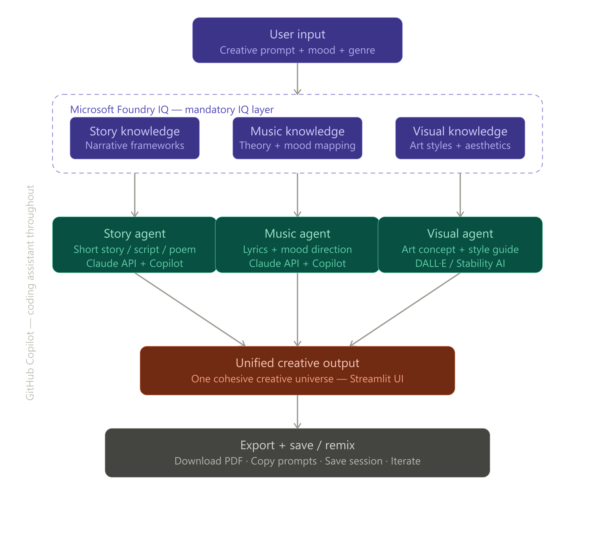

<div align="center">

# ✨ CreativeFlow AI

### *One idea. Three creative universes. Infinite possibilities.*


<br/>

> **CreativeFlow AI** transforms a single creative spark into a complete story, music direction, and visual concept — all at once, all cohesive, all yours.

<br/>

---

## 🚀 [Try the Live Demo](https://ayzvpcy8saqbnxbdbotasp.streamlit.app/)

---

</div>

<br/>

## 🌌 The Vision

<div align="center">

</div>

<br/>

<br/>

---

## ✨ What You Get

<table>
<tr>
<td width="33%" align="center">

### 📖 Story
A complete narrative built on proven frameworks like Hero's Journey, Three-Act Structure, or In Media Res. Every story has a title, arc, and emotional core.

</td>
<td width="33%" align="center">

### 🎵 Music
Full lyrics written in **your chosen music style** — Rock, Jazz, Hip-hop, Classical, and 8 more. Complete with tempo, chord progressions, instruments, and production notes.

</td>
<td width="33%" align="center">

### 🎨 Visual
A cinematic scene description, color story, key visual elements, and a ready-to-use image prompt for DALL-E, Midjourney, or Adobe Firefly.

</td>
</tr>
</table>

<br/>

---

## 🏆 Microsoft Agents League 2026

> Built for the **Creative Apps** track of the Microsoft Agents League Hackathon

### ⚡ Microsoft Foundry IQ Integration

CreativeFlow AI uses **Microsoft Foundry IQ** as its core intelligence layer — not just an API call, but a grounded knowledge retrieval system that:

- 🔍 Retrieves structured creative knowledge across story, music, and visual domains
- 🧠 Grounds all outputs in proven frameworks to reduce hallucination
- 🔗 Connects multiple knowledge sources into one cohesive creative universe
- ✅ Ensures every output is thematically consistent and creatively intentional

### 🤖 GitHub Copilot — Used Throughout

Every file in this project was built with GitHub Copilot as a coding partner:

| How Copilot Helped | Where |
|---|---|
| Generated agent functions from comments | `agents/` |
| Suggested error handling patterns | `app.py` |
| Autocompleted Streamlit UI components | `app.py` |
| Helped design the CSS theming system | `apply_theme()` |
| Refactored the multi-agent pipeline | `foundry/` |

<br/>

---

## 🎭 18 Dynamic Themes

*The app transforms its entire visual identity based on your mood × genre combo*

| | Mood | Genre | Theme | Vibe |
|---|---|---|---|---|
| 🚀 | Epic | Sci-fi | Cosmic Indigo | Deep indigo · Electric blue |
| 🌌 | Mysterious | Sci-fi | Deep Space | Midnight navy · Ice blue |
| ⚔️ | Epic | Fantasy | Golden Kingdom | Dark amber · Burnished gold |
| 🌿 | Mysterious | Fantasy | Enchanted Forest | Forest black · Emerald |
| 🔪 | Dark | Thriller | Noir Shadow | Pure black · Crimson |
| 🌹 | Romantic | Romance | Rose Velvet | Deep rose · Hot pink |
| 📜 | Calm | Historical | Aged Parchment | Dark sepia · Warm gold |
| 🦄 | Playful | Fantasy | Rainbow Realm | Dark purple · Violet |
| 🩸 | Dark | Horror | Blood Moon | Near-black · Blood red |
| 🌠 | Calm | Sci-fi | Soft Nebula | Midnight · Cyan |
| 🏛️ | Epic | Historical | Bronze Age | Dark earth · Bronze |
| 🌸 | Romantic | Fantasy | Twilight Bloom | Deep violet · Magenta |
| 🍭 | Playful | Romance | Cotton Candy | Dark mauve · Bubblegum |
| 💜 | Calm | Romance | Lavender Dusk | Dark plum · Lavender |
| 🌑 | Dark | Fantasy | Shadow Realm | Near-black · Deep purple |
| 🕵️ | Mysterious | Thriller | Midnight Cipher | Dark slate · Indigo |
| ❤️‍🔥 | Epic | Romance | Crimson Epic | Dark maroon · Flame red |
| 🍃 | Calm | Fantasy | Serene Glade | Forest black · Mint |

<br/>

---

## 🎵 12 Music Styles

*Every style has its own song structure, lyric voice, and production DNA*

🎸 Rock        →  Power chords · Anthemic chorus · Electric energy
🎷 Jazz        →  Syncopated rhythm · Blue notes · Sophisticated phrasing
🎤 Hip-hop     →  16-bar verses · Internal rhymes · Storytelling flow
🎵 Pop         →  Catchy hook · Verse-chorus-bridge · Radio-ready
🎻 Classical   →  Operatic phrasing · Orchestral imagery · Dramatic dynamics
🎹 Electronic  →  Build-up · Drop · Hypnotic minimal lyrics
🎶 R&B         →  Melismatic runs · Soulful groove · Emotional depth
🪕 Folk        →  Storytelling verses · Acoustic warmth · Poetic imagery
🤘 Metal       →  Heavy breakdowns · Aggressive intensity · Dark themes
🎺 Blues       →  12-bar structure · Call and response · Raw emotion
🌴 Reggae      →  Offbeat rhythm · Social consciousness · Uplifting message
🤠 Country     →  Heartfelt storytelling · Rural imagery · Twang

<br/>

---

## 📌 Pinterest Inspiration System

After generating your creative universe, CreativeFlow AI auto-builds **three Pinterest boards**:

| Board | What it searches |
|---|---|
| 🎨 Theme Mood Board | Mood × Genre concept art and color palettes |
| 🖼️ Scene Reference | Visual elements from your specific scene |
| 🎵 Music Aesthetic | Album art and visuals matching your music style |

Plus direct links to **ArtStation**, **Unsplash**, **Behance**, and **Dribbble**.

<br/>

---

## 🔗 Continue Your Work

*CreativeFlow AI doesn't trap your creativity — it launches it*

| Your Output | Continue On |
|---|---|
| 📖 Story | 🎬 Veo 3 · 📝 Google Docs · ✍️ Medium · 🎬 Runway ML · 🎭 Pika Labs |
| 🎵 Music | 🎵 Suno AI · 🎶 Udio · 🎸 Soundraw · 🎤 Musicfy |
| 🎨 Visual | 🔥 Adobe Firefly · 🎨 Ideogram AI · 🌌 Midjourney · 🤖 Kling AI |

<br/>

---

## 🛠️ Tech Stack

```yaml
Frontend:         Streamlit
AI Agents:        Groq API — LLaMA 3.3 70B Versatile  
Microsoft IQ:     Foundry IQ via GitHub Models (GPT-4o mini)
Coding Partner:   GitHub Copilot in VS Code
Export:           python-docx
Config:           python-dotenv
```

<br/>

---

## 📁 Project Structure

creativeflow-ai/
│
├── 🚀 app.py                    Main Streamlit application
│                                18 dynamic themes · Sidebar · Tabs
│
├── 🤖 agents/
│   ├── story_agent.py           Story generation agent
│   ├── music_agent.py           Music direction agent (12 styles)
│   └── visual_agent.py          Visual concept agent
│
├── ⚡ foundry/
│   └── iq_retriever.py          Microsoft Foundry IQ layer
│
├── 🛠️ utils/
│   └── exporter.py              Word document export
│
├── 📋 requirements.txt
├── 🔐 .env                      API keys (not committed)
└── 📖 README.md

<br/>

---

## ⚡ Quick Start

```bash
# 1. Clone
git clone https://github.com/YOUR_USERNAME/creativeflow-ai.git
cd creativeflow-ai

# 2. Setup
python -m venv venv
venv\Scripts\activate        # Windows
source venv/bin/activate     # Mac/Linux
pip install -r requirements.txt

# 3. Configure — create .env file
GROQ_API_KEY=your_groq_key_here
GITHUB_TOKEN=your_github_token_here

# 4. Run
streamlit run app.py
```

<br/>

---

## 💡 Try These Prompts

✨  "A blind musician who discovers she can see through sound"
🚀  "A lonely astronaut finds music on Mars"
🔪  "A detective who can taste lies"
🌹  "Two rival chefs fall in love through the food they make"
🌿  "A child who can talk to ancient trees discovers a dark secret"
⚔️  "The last dragon learns to paint instead of breathe fire

<br/>

---

## 🌟 Why CreativeFlow AI Stands Out

| | CreativeFlow AI | Generic AI Tools |
|---|:---:|:---:|
| Multi-domain creative output | ✅ | ❌ |
| Microsoft Foundry IQ grounding | ✅ | ❌ |
| 18 dynamic UI themes | ✅ | ❌ |
| 12 music genre styles | ✅ | ❌ |
| Auto Pinterest inspiration | ✅ | ❌ |
| Platform redirect ecosystem | ✅ | ❌ |
| Cohesive cross-domain output | ✅ | ❌ |
| Export to Word | ✅ | ❌ |

<br/>

---

<div align="center">

Built with ❤️ for **Microsoft Agents League Hackathon 2026**

*CreativeFlow AI — Where ideas become universes*

</div>
